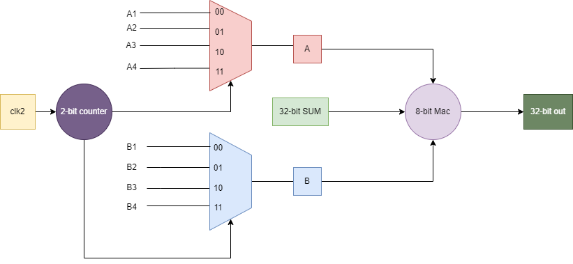

# One 8-bit MAC unit accelerator
We are using one unit to save area and minimise the delay. In order to do that we made divided the input into 4 8-bits passed to a 4x1 Mux and with the use of the 2-bits counter as a mux selector which increments with another clock 4x faster than the SoC's clock, we were able to implement the unit and get the desired functionality.

## Architecture:

## Area and Speed Analysis
#gates: 742		area(um2): 6377.37			delay(ps): 3877.12

## power Analysis
In order to add a second clock which is 4 times faster than the SoC's clock, we needed to implement a PLL which will multiply the original clock with a factor of 4. However, the PLL implementation will consume much area and power which contradicts out aim which is being area wise and energy effecient.  

# Four 8-bit MAC unit accelerator

## Motivation:
Since,area of MAC unit is very small (0.00235 mm^2) (264 gate cells) and the speed of one unit is 2.2ns less than 0.25% of clk cycle period, and to avoid the over head of using another clk, we propose that ML accelerator can consists of 4 8-bit MAC units.
The code will be found [here](https://github.com/nabadawy/Energy-Efficient-Soc-through-acceleration-for-IoT-applications/tree/main/ML%20Accelerator/4units-accelrator)

## Architecture :

## Area and Speed Analysis:

#gates: 2593		area(um2):23068.38		delay(ps):4859.73

## Cycles Analysis:

# Paralle MAC  Accelerator

## Motivation:
  Giving area of four_MAC accelerator is very small (0.0231 mm^2) (2593 cells). We then thought of designing A parallel mac accelerator to make use of parallelism operations in convolution and reduce memory Access by reusing input data. Each filter in convolution is convolved with input data pixels to produce one feature output map. Thus our idea is to produce a four_MAC path for each filter and thus the operations will run in parallel and the input data will be reused instead of reading it again.
 
The number of filters in the popular convloution architecture such vggNet and Alexnet in all layers are multiple of 4. Thus we decided that our accelerator will be a four_path parallel accelerator.

## Design
 The accelerator is developed of four parallel four_Mac accelerator.

## Architecture :

## simulation:

## Analysis :

## Testing on SoC :

After connecting Accelerator on SOC, we test the accelerator with a covloution function its input pixels are of size 5*5 and 3 input channels, the size of filters is 3x3 and we test once with two filters and another time with four filters. In the two filters case, we were able  to achieve an acceleration of 34.8% with parallel accelerator compared to 20.8% with four_Mac acceleraltor. For the four filters case, we were able to achieve an acceleration of 51.4% with parallel accelerator compared to 15.4% with four_Mac accelerrator.

## Results

