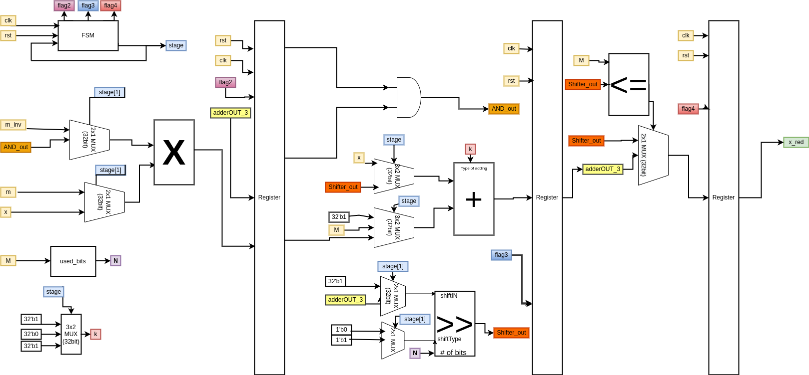

# Security Accelerator: Montgomery Reduction
This accelerator implements the montgomery reduction step used in modular multiplications in many security schemes (RSA, DH key exchange...etc.). This step calculates xR^-1 mod N as follows:
```
function REDC is
    input: Integers R and N with gcd(R, N) = 1,
           Integer N′ in [0, R − 1] such that NN′ ≡ −1 mod R,
           Integer x in the range [0, RN − 1].
    output: Integer t in the range [0, N − 1] such that t ≡ xR^−1 mod N

    m ← ((x mod R)N′) mod R
    t ← (x + mN) / R
    if t ≥ N then
        return t − N
    else
        return t
    end if
end function
```
When the function is implemented in digital systems, R is taken be 2^n, where n is the number of bits in N. Therefore, any mod R operation is implemented using a bitwise And, and any division by R is implemented with a right shift.
# Architecture:
Instead of implementing the algorithm in verilog in the straightforward way, it is implemented in a way to reuse some hardware components. So, in total this accelerator uses one shifter, one adder/subtractor, and one multiplier.
This is the block diagram of the accelerator:

# Design Analysis:
|              | Gate Count.    | Area(um^2).     |
| :---         |     :---:      |    :---:        |
| Accelerator  | 4513	        | 38677.09        |
| SoC          | 64177	        | 661798.46       |
| Percentage   | 7%             | 5.8%            |

The accelerator consumes 7% of the SoC's total number of gates and 5.8% of its area.

# Results:
|              | Without ACC.   | With ACC.     |
| :---         |     :---:      |    :---:      |
| Time(ns)     | 189810 ns      | 96300 ns      |
| Clock period | 10 ns          | 10 ns         |
| Clock cycles | 18981          | 9630          |
| speedup      |                | 49.3%         |
